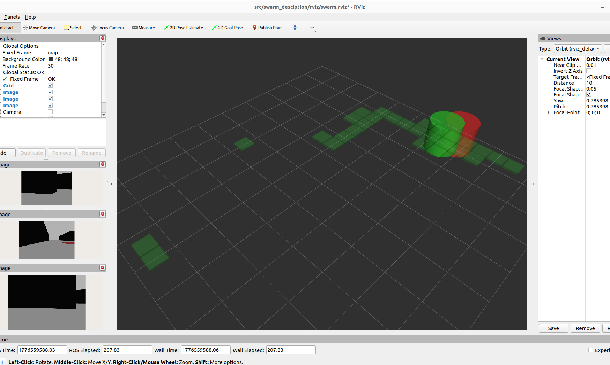

<div align="center">
  <h1>🤖 FLOW: Fraud and Load Optimization Workbench</h1>
  <p><strong>Autonomous Multi-Agent Swarm Sorting System</strong></p>

  <p>
    
    
    
    
    
  </p>

  <p>
    <em>Engineered for the CS671 Deep Learning Hackathon 2026 — Team 20, IIT Mandi</em>
  </p>
</div>

---

## 📌 Executive Summary

**FLOW (Fraud and Load Optimization Workbench)** is a fully autonomous, decentralized multi-agent robotic system. It orchestrates three differential-drive robots to explore a complex 10m × 8m warehouse, detect target objects using RGB-D sensor fusion, and sort them into designated bins without human intervention. 

By combining **Multi-Agent Reinforcement Learning (MAPPO)** for complex spatial navigation with **ROS 2** for decentralized swarm communication and **Classical Computer Vision** for deterministic object manipulation, this project demonstrates a robust, scalable architecture for real-world robotic deployment.

**[▶ Watch the Full Gazebo + RViz Demo](https://drive.google.com/drive/folders/1rAmYx1uS0PYUlfmj3ElJ-irtzrGSKGEo?usp=sharing)**

---

## 🚀 Key Technical Achievements

- **Multi-Agent Reinforcement Learning (MAPPO & PPO):** Architected a custom Pygame-based simulation environment (`rl_training/`) to benchmark 6 RL variants. Implemented **CTDE (Centralized Training, Decentralized Execution)** using MAPPO, achieving a **91% task completion rate** and reducing inter-robot collisions to near-zero.
- **Decentralized Swarm Intelligence:** Designed a peer-to-peer ROS 2 communication layer where robots share partial maps and discovered target coordinates, drastically reducing redundant exploration through distributed state management.
- **Hybrid Control Architecture:** Engineered a multi-layered decision pipeline that seamlessly transitions between high-level RL navigation policies and deterministic classical overrides (LiDAR-based obstacle avoidance and camera-centric visual servoing).
- **Sensor Fusion & Computer Vision:** Developed an optimized OpenCV pipeline operating at 10Hz to process RGB-D data, fusing spatial contours with depth-map proximity triggers for real-time target acquisition.
- **Automated Telemetry & Analytics:** Implemented a robust data-logging node that captures 5Hz odometry and swarm events, dynamically generating a comprehensive 3-page PDF mission report using Matplotlib.

---

## 🧠 Multi-Agent Reinforcement Learning (MARL)

Before migrating to Gazebo, policies were prototyped and trained in a highly parallelized, custom Gym environment (`rl_training/`).

### Algorithmic Benchmarking
We evaluated multiple architectures to solve the non-stationary challenges of multi-agent pathfinding in bottlenecked corridors:
1. **MAPPO (Multi-Agent PPO - CTDE) ⭐:** The winning architecture. The Centralized Critic observed the global state (171-dim) during training, while the Decentralized Actors relied strictly on local LiDAR/camera observations (57-dim) during deployment.
2. **PPO + Congestion Penalty:** Applied a bespoke proximity penalty to spread agents out, significantly outperforming vanilla PPO in tight warehouse aisles.
3. **Dueling Double DQN:** Served as the baseline RL approach, though it struggled with the non-stationary environment (26.8 collisions/episode).

<p align="center">
  
</p>

*For full details on the training framework, frame-stacking implementation, and reward shaping, see the **[RL Training Documentation](rl_training/README.md)**.*

---

## 🏗️ System Architecture & ROS 2 Integration

The system leverages a modular, decoupled ROS 2 Humble architecture, ensuring high scalability and fault tolerance.

### Software Stack
```text
[ Sensors (RGB-D, LiDAR) ] ➔ [ OpenCV Processing ] ➔ [ Hybrid Navigation (RL + Fallbacks) ] ➔ [ colcon / Gazebo ]
```

### The Hybrid Decision Engine
Running at 10Hz, each robot evaluates a prioritized state machine:
1. **Visual Servoing (Priority 1):** If a target is in the camera FOV, deterministic PID-like control aligns the robot perfectly with the object.
2. **Shared Map Override (Priority 2):** If the swarm network broadcasts a known bin location, the robot overrides exploration to seek it.
3. **RL Navigation (Priority 3):** Default navigation uses the trained MAPPO/PPO policy for efficient, collision-free warehouse traversal.
4. **Classical Fallback (Priority 4):** Wall-following algorithms trigger if the RL model encounters an unrecoverable local minimum.

<p align="center">
  
  <br/><em>Figure 1: RViz dashboard reflecting real-time decentralized exploration.</em>
</p>

---

## 📡 Decentralized Swarm Communication

Instead of relying on a centralized server, robots coordinate via a shared `/swarm/*` topic namespace. 

- **State Sharing:** `std_msgs/String` topics broadcast discovered objects, bin locations, and picked/placed events.
- **Exploration Efficiency:** Robots broadcast their visited grid cells. A centralized `visualization_node` aggregates this into a unified `MarkerArray` for RViz, ensuring agents do not explore identical sectors.
- **Locking Mechanism:** Once a robot broadcasts a `picked` event for a specific color, the swarm dynamically re-allocates targets to prevent collisions and duplicated effort.

---

## ⚙️ Installation & Usage

### Prerequisites
- **OS:** Ubuntu 22.04
- **Frameworks:** ROS 2 Humble, Gazebo Classic 11
- **Python:** 3.10+

### Build Instructions
```bash
# Install ROS 2 dependencies
sudo apt install ros-humble-gazebo-ros-pkgs ros-humble-gazebo-ros \
                 ros-humble-robot-state-publisher ros-humble-xacro ros-humble-tf2-ros

# Install ML / CV dependencies
pip3 install stable-baselines3 gymnasium opencv-python-headless numpy matplotlib cv_bridge

# Build the ROS 2 Workspace
source /opt/ros/humble/setup.bash
colcon build --symlink-install
source install/setup.bash
```

### Running the Simulation
```bash
# 1. Launch the Gazebo world and the 3 robot agents
ros2 launch swarm_description multi_robot.launch.py

# 2. Visualize swarm intelligence in RViz
rviz2 -d src/swarm_description/rviz/swarm.rviz

# 3. Generate the PDF Analytics Report (Post-Simulation)
python3 plot_metrics.py swarm_log_<timestamp>.json --pdf swarm_report.pdf
```

---
*Developed by Team 20 — CS671 Deep Learning Hackathon 2026, IIT Mandi*