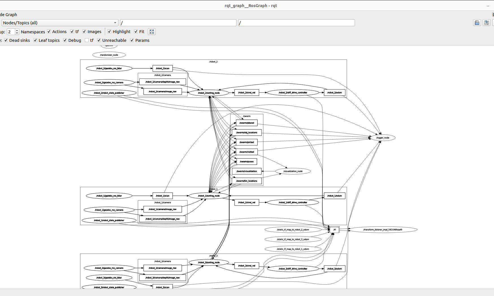
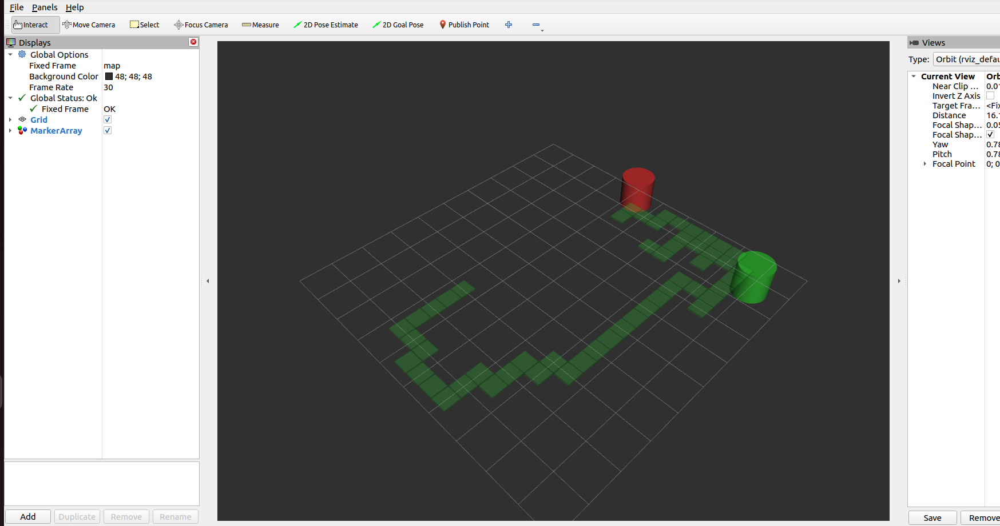
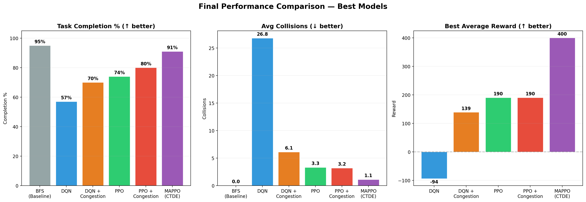

<div align="center">
  <h1>🤖 Multi-Agent Warehouse Coordination System</h1>
  <p align="center">
    <strong>Decentralized Multi-Robot Exploration, Object Detection & Sorting</strong>
  </p>


  <p>
    
    
    
    
    
  </p>

  <p>
    <em>Engineered for the CS671 Deep Learning Hackathon 2026 — Team 20, IIT Mandi</em>
  </p>
</div>

---

## 📌 Executive Summary

**Multi-Agent Warehouse Coordination System** is a fully autonomous, decentralized multi-agent robotic system. It orchestrates three differential-drive robots to explore a complex 10 m × 8 m warehouse, detect target objects using RGB-D sensor fusion, and sort them into designated bins without human intervention. 

By combining **Multi-Agent Reinforcement Learning (MAPPO)** for complex spatial navigation with **ROS 2** for decentralized swarm communication and **Classical Computer Vision** for deterministic object manipulation, this project demonstrates a robust, scalable architecture for real-world robotic deployment.

**[▶ Watch the Full Gazebo + RViz Demo on Google Drive](https://drive.google.com/drive/folders/1rAmYx1uS0PYUlfmj3ElJ-irtzrGSKGEo?usp=sharing)**

---

## Table of Contents

- [Executive Summary](#-executive-summary)
- [Key Technical Achievements](#-key-technical-achievements)
- [System Architecture](#system-architecture)
- [Robot & World Specifications](#robot--world-specifications)
- [Component Descriptions](#component-descriptions)
- [Reinforcement Learning](#reinforcement-learning)
- [Inter-Robot Communication](#inter-robot-communication)
- [Installation & Setup](#installation--setup)
- [Usage](#usage)
- [Dependencies](#dependencies)

---

## 🚀 Key Technical Achievements

- **Multi-Agent Reinforcement Learning (MAPPO & PPO):** Architected a custom Pygame-based simulation environment (`rl_training/`) to benchmark 6 RL variants. Implemented **CTDE (Centralized Training, Decentralized Execution)** using MAPPO, achieving a **91% task completion rate** and reducing inter-robot collisions to near-zero.
- **Decentralized Swarm Intelligence:** Designed a peer-to-peer ROS 2 communication layer where robots share partial maps and discovered target coordinates, drastically reducing redundant exploration through distributed state management.
- **Hybrid Control Architecture:** Engineered a multi-layered decision pipeline that seamlessly transitions between high-level RL navigation policies and deterministic classical overrides (LiDAR-based obstacle avoidance and camera-centric visual servoing).
- **Sensor Fusion & Computer Vision:** Developed an optimized OpenCV pipeline operating at 10Hz to process RGB-D data, fusing spatial contours with depth-map proximity triggers for real-time target acquisition.
- **Automated Telemetry & Analytics:** Implemented a robust data-logging node that captures 5Hz odometry and swarm events, dynamically generating a comprehensive 3-page PDF mission report using Matplotlib.

---

## System Architecture

```
┌──────────────────────────────────────────────────────────┐
│                    GAZEBO SIMULATION                     │
│   ┌──────────┐    ┌──────────┐    ┌──────────┐          │
│   │ robot_1  │    │ robot_2  │    │ robot_3  │          │
│   │ LiDAR    │    │ LiDAR    │    │ LiDAR    │          │
│   │ RGB-D    │    │ RGB-D    │    │ RGB-D    │          │
│   └────┬─────┘    └────┬─────┘    └────┬─────┘          │
└────────┼───────────────┼───────────────┼────────────────┘
         │               │               │
    ┌────▼────┐     ┌────▼────┐     ┌────▼────┐
    │Sorting  │     │Sorting  │     │Sorting  │
    │ Node 1  │     │ Node 2  │     │ Node 3  │
    └────┬────┘     └────┬────┘     └────┬────┘
         └───────────────┼───────────────┘
                         │
              ┌──────────▼──────────┐
              │   /swarm/* Topics   │
              │ visited · poses     │
              │ obj_locations       │
              │ bin_locations       │
              │ picked · placed     │
              └──────────┬──────────┘
                         │
             ┌───────────┼───────────┐
        ┌────▼──┐   ┌────▼───┐  ┌───▼────────┐
        │Logger │   │VizNode │  │Randomizer  │
        │ Node  │   │(RViz)  │  │   Node     │
        └───────┘   └────────┘  └────────────┘
```

**Startup sequence (`multi_robot.launch.py`):**

| Time | Event |
|------|-------|
| t = 0 s | Gazebo server starts with warehouse world |
| t = 2 s | `LoggerNode` starts |
| t = 3 / 8 / 13 s | `robot_1`, `robot_2`, `robot_3` spawned (staggered) |
| t = 6 / 11 / 16 s | `SortingNode` started per robot (3 s after spawn) |
| t = 18 s | `RandomizerNode` runs — shuffles object/bin positions |

<p align="center">
  
  <br/>
  <em>Figure 2 — Full ROS 2 computation graph captured via <code>rqt_graph</code>, showing all nodes, topics, and dataflow across the three robots and the shared swarm layer.</em>
</p>

---

## Robot & World Specifications

### Robot Model (`swarm_bot.urdf.xacro`)

| Component | Specification |
|-----------|---------------|
| Chassis | 0.30 × 0.20 × 0.08 m, 2.0 kg |
| Drive wheels | 2× cylindrical (r = 0.04 m), continuous joints, μ = 1.0 |
| Caster wheel | 1× rear sphere (r = 0.02 m), fixed joint, μ = 0.0 |
| LiDAR | 360 samples, 0.12–3.5 m range, 10 Hz, Gaussian noise σ = 0.01 |
| RGB-D camera | 640 × 480, 60° HFoV, 0.05–8.0 m depth, 10 Hz |
| Differential drive | `libgazebo_ros_diff_drive.so`, 30 Hz, max torque 5.0 Nm |

### Warehouse World (`warehouse.world`)

| Parameter | Value |
|-----------|-------|
| Dimensions | 10 m × 8 m |
| Walls | 4 perimeter walls, 1.0 m tall |
| Shelves | 8 (3 columns × 3 rows at y = –2.0, 0.0, +2.0 m) |
| Objects | 3 coloured cubes, 0.15 m³ (dynamic) |
| Bins | 3 coloured pads, 0.6 m² (static) |
| Physics | ODE, 3 ms step, 333 Hz |
| Placement | Randomised from 15 pre-verified collision-free positions |

---

## Component Descriptions

### `sorting_node.py` — Core Agent (460 lines)

Runs one instance per robot at 10 Hz. Implements a full sense → decide → act loop.

**Decision priority (evaluated top-down every tick):**

| Priority | Source | Condition |
|----------|--------|-----------|
| 1 | Camera override | Object/bin visually detected → steer to align (camera centre ± 100 px) |
| 2 | Shared map override | Known bin location from swarm comms → steer toward bearing if path is clear |
| 3 | PPO RL model | General navigation: Forward / Left / Right from `ppo_nav_model.zip` |
| 4 | Classical fallback | Wall-following and obstacle avoidance |

**Navigation modes:**

- `NORMAL` — default; follows RL + overrides
- `WALL_FOLLOW` — activated when an obstacle blocks path to a shared-map target; times out to `EXPLORE` after 15 s
- `EXPLORE` — 30 s free-roam override to escape dead ends

**Task state machine:**

```
EXPLORE → OBJECT DETECTED → PICK → SEEK BIN → PLACE (5s dwell) → DONE
```

---

### `camera_processor.py` — Colour Vision Pipeline (102 lines)

Converts BGR → HSV and applies per-colour masks:

| Colour | Hue range | S, V range |
|--------|-----------|------------|
| Red | H ∈ [0,10] ∪ [170,180] | [50, 255] |
| Green | H ∈ [40, 80] | [50, 255] |
| Blue | H ∈ [100, 140] | [50, 255] |

- **Object vs bin classification:** aspect ratio > 1.5 → bin; otherwise → object
- **`is_close` trigger:** depth < 0.25 m or contour area > 45,000 px²
- **`target_direction`:** 0 = centred, 1 = left, 2 = right (relative to camera centre ± 100 px)

---

### `rl_env.py` — Gymnasium Training Environment (134 lines)

Lightweight, Gazebo-free environment for offline PPO training.

| Parameter | Detail |
|-----------|--------|
| Action space | `Discrete(3)` — Forward, Turn Left, Turn Right |
| Observation space | `MultiDiscrete([4,4,3,2,2,2,2,3])` — carrying, target_type, target_dir, wall_front, wall_side_left, wall_side_right, visited_ahead, last_action |
| Episode length | 200 steps |

**Reward shaping:**

| Event | Reward |
|-------|--------|
| Wall collision (forward into wall) | –10.0 |
| Revisiting explored cell | –3.0 |
| Wiggle (alternating L/R turns) | –2.0 |
| Ignoring visible target | –2.0 |
| Target reached (centred, forward) | +5.0 |
| Correct turn toward target | +3.0 |
| Obstacle avoidance (correct turn) | +1.0 to +2.0 |
| Forward in open space | +1.0 |
| Per-step time penalty | –0.1 |

---

### `randomizer_node.py` — Position Randomiser (110 lines)

Runs once at startup. Selects from 15 pre-verified, collision-free warehouse positions. Assigns first 3 to objects, next 3 to bins. Guarantees no object-bin overlap and no shelf collisions. Waits up to 60 s for the `/set_entity_state` Gazebo service.

---

### `logger_node.py` — Simulation Logger (162 lines)

Records the full simulation run for post-hoc analysis:

- **Trajectories:** odometry for all 3 robots, downsampled to 5 Hz
- **Events:** `discovered`, `picked`, `placed` — with timestamp, position, and robot identity
- **Output:** timestamped JSON on shutdown — `swarm_log_YYYYMMDD_HHMMSS.json`

---

### `visualization_node.py` — RViz Marker Publisher (124 lines)

Publishes `MarkerArray` to `/swarm/visualization` at 1 Hz:

- **Visited grid:** green semi-transparent cube-list of explored cells
- **Shared bins:** coloured cylinders at discovered bin positions

<p align="center">
  
  <br/>
  <em>Figure 3 — RViz visualisation of the shared exploration map (green tiles) and discovered bin locations (coloured cylinders). Green tiles are populated as robots broadcast visited grid cells; bin cylinders appear as soon as any robot's camera detects and estimates a bin position.</em>
</p>

---

### `plot_metrics.py` — PDF Report Generator (548 lines)

Post-simulation tool. Run after the simulation completes:

```bash
python3 plot_metrics.py swarm_log_20260419_041230.json --pdf swarm_report.pdf
```

Produces a 3-page dark-themed PDF:

| Page | Content |
|------|---------|
| 1 — Executive Summary | Mission KPIs, collaboration matrix (who discovered vs. who picked), chronological event log |
| 2 — Spatial Analysis | Top-down warehouse map with robot trajectories and pick/place markers |
| 3 — Task Distribution | Gantt-style chart — exploration and delivery phases per robot per object |

---

## Reinforcement Learning

| Parameter | Value |
|-----------|-------|
| Algorithm | PPO (Proximal Policy Optimisation) |
| Library | Stable-Baselines3 |
| Policy | `MlpPolicy` (fully-connected) |
| Learning rate | 0.001 |
| Batch size | 64 |
| Rollout length | 2048 steps |
| Parallel envs | 4 (`SubprocVecEnv`) |
| Training steps | 100,000 (configurable) |
| Model output | `ppo_nav_model.zip` |

**Why hybrid (PPO + classical)?**  
The RL policy handles open-ended exploration in uncertain space. Classical overrides guarantee collision avoidance (LiDAR), target alignment (camera centring), and coordination (shared topics) — behaviours where determinism is required.

### Standalone RL Prototyping & Algorithms (`rl_training/`)

In addition to the Gazebo deployment, this repository includes a fast, Pygame-based standalone RL training environment (`rl_training/`). We use this environment to prototype and benchmark multiple algorithms before migrating the final models to ROS 2. 

**Key Features:**
- **30×30 grid** with narrow aisles, bottlenecks, and 10 randomized objects
- **Partial observability** — objects are hidden until discovered via exploration
- **Congestion-aware navigation** with proximity penalty to spread out agents
- **Mixed cooperative rewards** (70% individual + 30% team average)

**Evaluated Algorithms:**
1. **BFS** (Baseline) - Shortest-path grid search
2. **DQN (Dueling Double DQN)** - Shared feature extractor with experience replay
3. **PPO (Proximal Policy Optimization)** - Shared backbone with actor/critic heads
4. **MAPPO (Multi-Agent PPO — CTDE) ⭐** - Centralized Training (critic sees global state), Decentralized Execution (actor sees local state)

**Performance Highlights (10,000 Episodes):**


- **MAPPO (CTDE)** achieved the highest reward (400) and an impressive 91% task completion rate with near-zero collisions (1.1 avg).
- **PPO + Congestion** significantly improved completion (80%) by avoiding bottlenecks compared to vanilla PPO.
- **Vanilla DQN** struggled heavily with collisions and instability.

For full details on the training framework, deep dives into the learning curves, and sim-to-Gazebo transfer instructions, see the **[RL Training Documentation](rl_training/README.md)**.

---

## Inter-Robot Communication

All coordination uses a shared `/swarm/*` topic namespace (publish-subscribe, no central coordinator):

| Topic | Message type | Purpose |
|-------|-------------|---------|
| `/swarm/visited` | `std_msgs/String` | Grid cells explored by any robot |
| `/swarm/obj_locations` | `std_msgs/String` | Discovered object positions (colour, x, y, discoverer) |
| `/swarm/bin_locations` | `std_msgs/String` | Discovered bin positions (colour, x, y) |
| `/swarm/picked` | `std_msgs/String` | Pick events (colour, robot, x, y) |
| `/swarm/placed` | `std_msgs/String` | Place events (colour, robot, x, y) |
| `/swarm/poses` | `geometry_msgs/PoseStamped` | Real-time pose of each robot |
| `/swarm/visualization` | `visualization_msgs/MarkerArray` | RViz markers (visited grid + bins) |

Once an object is globally marked as picked, no other robot targets it. Visited cells are shared, reducing redundant exploration coverage.

---

## Installation & Setup

### Prerequisites

- Ubuntu 22.04
- ROS 2 Humble Hawksbill (desktop install)
- Gazebo Classic 11 (included with `ros-humble-gazebo-ros-pkgs`)
- Python 3.10+

### Install Dependencies

```bash
# ROS 2 + Gazebo
sudo apt install ros-humble-gazebo-ros-pkgs ros-humble-gazebo-ros \
                 ros-humble-robot-state-publisher ros-humble-xacro \
                 ros-humble-tf2-ros

# Python
pip3 install stable-baselines3 gymnasium opencv-python-headless \
             numpy matplotlib cv_bridge
```

### Build

```bash
source /opt/ros/humble/setup.bash
colcon build --symlink-install
source install/setup.bash
```

---

## Usage

```bash
# 1. Launch full simulation (Gazebo + 3 robots + all nodes)
ros2 launch swarm_description multi_robot.launch.py

# 2. Monitor in RViz (optional)
rviz2 -d src/swarm_description/rviz/swarm.rviz

# 3. After Ctrl+C — generate PDF mission report
python3 plot_metrics.py swarm_log_<timestamp>.json --pdf swarm_report.pdf

# 4. Retrain the RL model (optional)
cd src/swarm_nav/swarm_nav
python3 train_rl.py
```

---

## Dependencies

| Package | Version | Purpose |
|---------|---------|---------|
| ROS 2 Humble | 2022.11+ | Middleware & communication |
| Gazebo Classic | 11.x | Physics simulation |
| Python | 3.10+ | Runtime |
| Stable-Baselines3 | ≥ 2.0 | PPO training & inference |
| Gymnasium | ≥ 0.26 | RL environment API |
| OpenCV | ≥ 4.5 | HSV colour detection |
| NumPy | ≥ 1.21 | Numerical computation |
| Matplotlib | ≥ 3.5 | PDF report generation |
| cv_bridge | ROS pkg | ROS ↔ OpenCV image conversion |

---

*Team 20 — CS671 Deep Learning Hackathon 2026, IIT Mandi*
